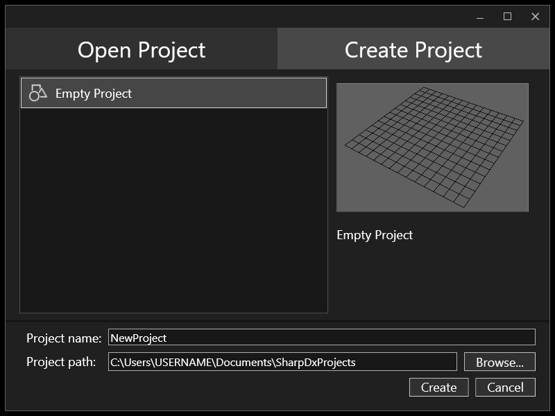
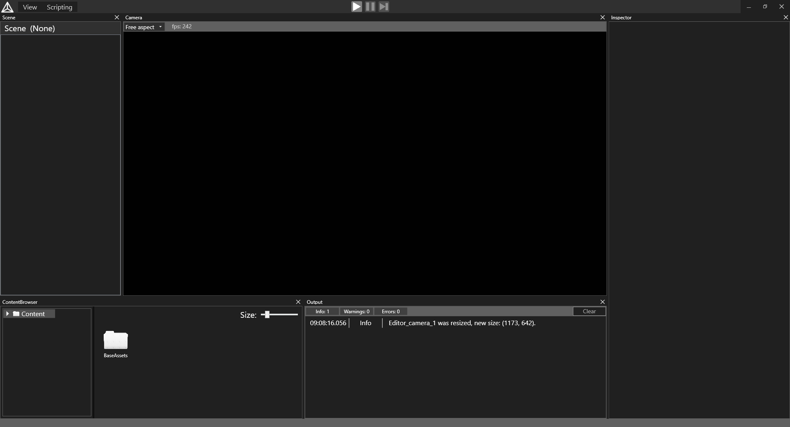

# SharpDXtest

SharpDXtest is a custom game engine developed in C#.  
It was developed in 2021-2024 in context of 3 different courses as well as in spare time. It was also used as a base for both bachelor's and master's theses. 

It includes:

- Editor in WPF (with custom tool docking system), 
- Projects system (with simple Visual Studio integration),
- Assets pipeline (importing, tracking, configuring assets),
- Rendering (DirectX 11 via SharpDX, deferred PBR, cascaded shadow mapping),
- Sounds (XAudio 2),
- Input management,
- Unity-like scripting in C#,
- Custom physics.

## Requirements
<a href="https://dotnet.microsoft.com/en-us/download/dotnet/8.0">.NET 8</a>

## Install
1) <a href="https://github.com/Notrum666/SharpDXtest/releases">Download</a> latest release
2) Unzip archive contents to any folder
3) Launch Editor.exe

## Build
1) Clone <a href="https://github.com/Notrum666/SharpDXtest/tree/master">master</a> branch to any folder
2) Open Visual Studio solution
3) Select Debug or Release configuration
4) Start building the solution
5) Let Visual Studio find and get all the required packages
6) Launch "Editor" project

## Guide
Upon launching - navigate to "Create Project" tab in projects window, select the empty template, enter desired project name and location and create the project.

The created project is empty. Completely empty. First you will have to create a new scene in content browser tool and open it to be able to add objects.
Then you can add empty objects to the scene in scene overview tool, select them and add components to them in Inspector.

More full guide in form of videos can be found <a href="https://www.youtube.com/playlist?list=PL8YxMInI71UvIVWpi19K3UfJYHqgzG7YB">here</a> (in russian only)

## Acknowledgments
Special thanks to <a href="https://github.com/YahimaB">YahimaB</a> for immence help with engine architecture, assets pipeline, logger, profiler, project system, scripting system and much more.  
Special thanks to <a href="https://github.com/Hrenaki">Hrenaki</a> for immence help at the very beginning of the project, with initlal architecture, linear algebra library, custom physics and much more.  
Thanks to <a href="https://github.com/SmirnovArsenty">SmirnovArsenty</a>, <a href="https://github.com/FstSlacker">FstSlacker</a> and <a href="https://github.com/xbadmojox">xbadmojox</a> for contributions.
